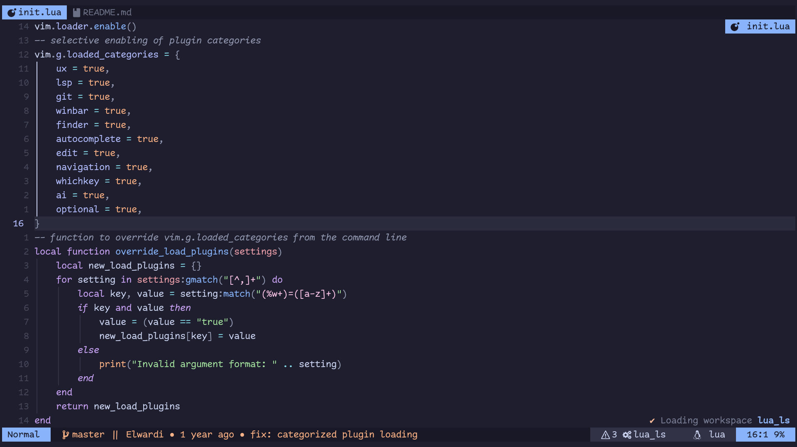

This is my minimal(?), clutter-free, less-than-a-million-keymaps Neovim configuration for day-to-day programming.

> [!TIP]
> Best used with **Kitty** terminal (or Alacritty if you prefer that), running a PowerLine font (or at least,
> a font that has some ligatures support)


> [!IMPORTANT]
> Want to get started? -> Press `<space>` and discover what's possible from there

Here are a few programming languages I usually write in:
- C++/C (and OpenFOAM code)
- Python, Lua as scripting languages
- HTML, CSS, JavaScript/TypeScript for web development
- Markdown for writing READMEs and other documentation, LATEX for academic writing
- GdScript, GLSL for game development
- Latex2text command if you want to render Tex equations in Markdown
- Obviously, Bash for shell scripting

This configuration will never support the following features:
- Debugging. Not an editor's job, use GDB and the like.
- Format-on-Save, because trying to auto-format C++ is a pain!

> [!IMPORTANT]
> Check out the [Screenshots][] for a preview of what this configuration has to offer.



<!-- mtoc-start:cb9ef56 -->

* [Requirements](#requirements)
* [Set up](#set-up)
* [Documentation](#documentation)
* [List of plugins and important configs](#list-of-plugins-and-important-configs)
  * [General Notes](#general-notes)
  * [General](#general)
  * [UI](#ui)
  * [Productivity](#productivity)
  * [Navigation](#navigation)
  * [Language support and LSPs](#language-support-and-lsps)
  * [AI](#ai)
  * [Git integration](#git-integration)
  * [Miscellaneous](#miscellaneous)

<!-- mtoc-end:cb9ef56 -->

## Requirements

- [Neovim][] **nightly** (v0.11.4 or later), [NodeJS][] **v22** (or later), preferably installed with [NVM][],
- Python 3 and (optionally) [Rust][]
- The tree-sitter CLI. Install with `npm install -g tree-sitter-cli`
- For installing some LSP servers, you will need the `unzip` command
- For Todo-comments and various other searching tasks, you will need [RIPGrep][]
- A terminal with ligature support ([Kitty][], Warp, Alacritty, etc.)
  - For kitty, I like to set (after installing Comic Code Ligatures, Font Awesome and Symbols Nerd Font Mono):
    ```
    font_family      ComicCodeLigatures
    symbol_map U+f000-U+f0e2 fontawesome
    symbol_map U+23FB-U+23FE,U+2665,U+26A1,U+2B58,U+E000-U+E00A,U+E0A0-U+E0A3,U+E0B0-U+E0D4,U+E200-U+E2A9,U+E300-U+E3E3,U+E5FA-U+E6AA,U+E700-U+E7C5,U+EA60-U+EBEB,U+F000-U+F2E0,U+F300-U+F32F,U+F400-U+F4A9,U+F500-U+F8FF,U+F0001-U+F1AF0 Symbols Nerd Font Mono
    ```
- [ImageMagick][] for in-terminal image display, if your terminal supports
- Also [mermaid-cli][] for mermaid charts in markdown files
  - Note that on Ubuntu 23+ this requires changes to apparmor policies on retricting user namespaces;
    if you don't write mermaid charts often, don't bother with this

## Set up

1. Make sure you have all the requirements installed. [this docker file](/dockerImages/config.dockerfile) shows how to install
   most of them on latest Ubuntu LTS release.
2. Then, applying this configuration is as easy as:
```sh
# Backup old configs and clone the new ones
mv ~/.config/nvim ~/.config/nvim.bak
git clone https://github.com/FoamScience/configs.nvim ~/.config/nvim
# also, update with git pull
```

Or you can give it a try in a Docker container:
```sh
cd dockerImages
docker build -t nvim-config:latest -f config.dockerfile . 
docker run -it --rm nvim-config:latest bash
(container)> USER=me nvim
```

## Documentation

A few tutorials can be accessed by `<leader>tt` when `nvim` command had no files
passed in as a CLI. These are not meant to teach people basic Vim skills but
rather explain my current approach to editing efficiency.

Even though the tutorials act on Lua files, they mostly hold on any other filetype.

Occasionally, you'd have to `:TutorialNext` to continue a tutorial, either becausse
I was too lazy to implement proper step validation or implementing it would not
have provided a good experience.

## List of plugins and important configs

### General Notes

- The canonical way to move between open buffers is `<tab>` and `<S-tab>` in normal mode.
- The canonical way to move on visible screen portion is by pressing `s` and `S` in normal mode.
- The canonical way to move between tabs and splits is `<C-w><C-w>`; too fundamental to change.
- Typically, you'll want to set Tmux to move between panes with `<C-s><arrows>`.
- You can bookmark files (Press `,`) within each project for faster workflow. This was preferred over session management.
- You can see registers content by pressing `"`, and marks positions by pressing the back-tick '`'
- `<leader>fk` lists all available key bindings and `<leader>fC` lists commands.
- `<leader>fP` will take you to individual plugin configuration!
- `<leader>kk` brings up a sticky-notes sidebar. it persists; and it's project-specific!
  - you can create mutiple notes per projects and notes content is in Markdown

The plugins are organized into categories, and it takes my machine **60ms** to load a C++ file.
If you find it slow, you can always disable some categories in `init.lua`, or specific plugins in their configuration file.

If you want to load only certain categories:
```sh
nvim --cmd "lua vim.g.plugin_settings = 'ux=true,git=true,lsp=true'" file.cpp
```

You can also load your custom configuration by putting it in `~/.config/nvim/lua/$USER/` where `$USER` is your username:
- Files returning a table, with a `config()` function, will be considered as [Lazy.nvim] specs.
- Everyting else just gets executed as a lua script

> [!IMPORTANT]
> Some plugin configurations will attempt to read user-specific options from the return table in
> `~/.config/nvim/lua/$USER/user-settings.lua`. This is useful for example to set your own Neorg
> workspaces, or AI response language. Take a look at this
> [user-settings.lua](lua/fadeli/user-settings.lua) for inspiration.

Also, you can turn on automatic checking of configuration updates to keep
your local configuration in sync with new commits from this repo. This only does the check though,
you will have to run `git pull` on your own:
```lua
-- in lua/<your-username>/whatever.lua
vim.g.config_check_for_updates = true
```

### General

- [keymaps.lua:](lua/user/keymaps.lua) very few key bindings to get you started
  - `<space>` is the **leader key**, which is used to open `which-key` menu in normal mode
  - `<tab>` and `<S-tab>` in normal mode are used for buffer switching
- [which-key.lua:](lua/user/which-key.lua) shows all available keymaps
  - Press `<leader>` to check available keymaps
  - Shows Vim keymaps on `` ` `` (marks), `"` (registers), `z` (folds and spelling), `g` (operators)
  and `<c-w>` (window navigation)
- [telescope.lua:](lua/user/telescope.lua) fuzzy finder for files, buffers, etc.
  - `<leader>f` take advantage of it
  - In particular `<leader>fk` shows all configured keymaps 
  - Open the file from its Git history without checking out earlier commits with `<leader>fF` 
  - Browse the Undo tree (including diffs!) with `<leader>fu`
  - Open Plugin configuration files with `<leader>fP`
- [projects.lua:](lua/user/projects.lua) a project manager, mostly for detecting root directories
  - `<leader>fp` to open recent projects list
- [dial.lua:](lua/user/optional/dial.lua) a plugin for incrementing and decrementing stuff
  - Overhauled `<c-a>` and `<c-x>` to increment and decrement things (numbers, dates, ..., etc)
- [colorscheme.lua](lua/user/colorscheme.lua) is where the color scheme is set
  - Try `:Telescope colorscheme` (or just `<leader>fc`) to see a live demo of all available color schemes
  - By default, we are using a modified dark [ayu](https://github.com/Shatur/neovim-ayu) theme
- [undo.lua](lua/user/undo.lua) is an Undo tree visualizer, with diff views. `<leader>eu` to toggle. 

### UI

- [snacks.lua](lua/user/snacks.lua) a collection of UI niceties from folke
- [nvimtree.lua:](lua/user/nvimtree.lua) a file explorer. Simple as that
  - `<leader>e` to toggle
- ~~[lualine.lua:](lua/user/lualine.lua) fast and pretty statusline~~
- [mini-statusline.lua](./lua/user/mini-statusline.lua) for status and tabline configuration
- [incline.lua](lua/user/incline.lua) for floating buffer names at top-right corners of windows
- ~~[indentline.lua:](lua/user/indentline.lua) improves code indentation~~
- [noice.lua:](lua/user/noice.lua) nicer UI. Not relevant for users
- [colorizer.lua:](lua/user/optional/colorizer.lua) colorizes color codes in CSS, HTML, etc.
- [dim.lua:](lua/user/optional/dim.lua) dims inactive code sections
  - Setup for proper dimming of OpenFOAM entries
  - `<leader>wt` to toggle
- ~~[winsep.lua:](lua/user/optional/winsep.lua) a plugin for colored window separators, useful with Tmux.~~
- [cinnamon.lua:](lua/user/optional/cinnamon.lua) scrolling cursor animations.
- [render-markdown.lua:](lua/user/render-markdown.lua) prettifying Markdown document editing.
  - With support for Latex equation rendering
- [guess-indent.lua](lua/user/guess-indent.lua) to guess indentation style (tabs/spaces)
  for current file and setting global options accordingly.
  - Should be automatic, but `:GuessIndent` helps
- ~~[image.lua:](lua/user/optional/image.lua) optionally render Markdown images~~
  - Enabled only if running on `kitty` terminal and using `imagemagick` backend.
  - Replaced with `snacks.image` which has similar constraints

### Productivity

- [todo-comments.lua:](lua/user/todo-comments.lua) highlights `@todo:`, `@body:`, `@warn:`, etc. in comments
  - `:TodoTelescope` command opens a fuzzy finder for all such comments in the current buffer
  - Use [todo-issue Github action](https://github.com/DerJuulsn/todo-issue) to convert your committed
    Todos to Github issues.
- ~~[waka.lua:](lua/user/optional/waka.lua) a plugin for tracking your coding time~~
  - ~~It will ask for an [API key](https://wakatime.com/settings/api-key) on installation~~
- ~~[leetcode.lua:](lua/user/optional/leetcode.lua) a plugin for solving LeetCode problems~~
  - `nvim leetcode.nvim` to open
  - Login by copying a cookie token from your browser. Take a look at [the plugin's docs](https://github.com/kawre/leetcode.nvim)
    for more info.
- ~~[devdocs.lua:](lua/user/optional/devdocs.lua) a plugin for browsing DevDocs.~~

### Navigation

- [flash.lua:](lua/user/flash.lua) fast word hopping
  - `s` (or `gs`) to hop to words in normal mode
  - `S` (or `gS`) to hop using tree-sitter syntax tree in normal mode
  - `r` in operator mode to do operations between flash hops
  - `R` in operator mode to do operations between flash tree-sitter searches
  - `<ctrl-s>` to toggle flash in regular search mode. An icon at the bottom right will show up if this is enabled.
- ~~[harpoon.lua:](lua/user/harpoon.lua) to bookmark your buffers, and come back to them in a blink of an eye~~
- [arrow.lua:](lua/user/arrow.lua) to bookmark your buffers. Replacing Harpoon.
    - Just press `,` in normal mode, or `<leader>b`
- [navbuddy.lua:](lua/user/navbuddy.lua) fast local code navigation
  - `<leader>o` to toggle
  - Only enabled on specific file types, such as OpenFOAM, C++, Python, Lua files

### Language support and LSPs

- [treesitter.lua:](lua/user/treesitter.lua) syntax highlighting and code folding
  - Sets up a few languages by default; such as C++, Python, Lua and OpenFOAM
  - Auto-installs tree-sitter grammars for languages the first time they are encountered
  - Text objects for classes, functions, loops and conditions through [treesitter-textobjects.lua](lua/user/treesitter-textobjects.lua)
- [mason.lua:](lua/user/mason.lua) sets up a few language servers to support common languages
  - C++/C: with `clangd`, OpenFOAM with `foam_ls`, Lua with `lua_ls` and a few more
    - `clangd` is not managed through Mason on ARM machines, run `apt install clangd` instead
  - Type `:Mason` in normal mode for more.
- [lspconfig.lua:](lua/user/lspconfig.lua) configures the LSP servers and sets up keymaps for some features
  - `gd` and `gD` for go to definition and declaration
  - `K` for hover info
  - You can also get to similar functionality through `<leader>l` which uses which-key
- [cmp.lua:](lua/user/cmp.lua) autocompletion engine
  - `<tab>` to cycle through suggestions, `<cr>` to confirm
  - Autocompletes file paths, snippets, and LSP-related things
  - Buffer completion is left to vim's native: `<c-x>-n` menu
  - ~Even searches with `/`. Type `/@` to search through LSP symbols in code buffers!~
  - ~Completes math functions in Vim's expression register (`<c-r>` in insert mode)~
  - Also provides command line completion on `:`
- [garbage.lua:](lua/user/garbage.lua) a garbage collection for inactive LSP servers
- [navic.lua:](lua/user/navic.lua) shows code structure at the cursor in the winbar

### AI

- [codecompanion.lua:](lua/user/codecompanion.lua) The best AI companion; easy and fun to use
  - [Groq](https://console.groq.com/docs/models) models are the default.
  - Needs a `GROQ_API_KEY` which can be obtained for free from [console.groq.com](https://console.groq.com/keys)
  - If you intend to use the `@{search_web}` tool, obtain a free `TAVILY_API_KEY` from [tavily.com](https://app.tavily.com/home)
  - Can disable code sharing with LLM cloud services in `lua/<your-username>/user-settings.lua`
  - `<leader>a` in normal and visual mode to get started.
- ~~[sg.lua:](lua/user/optional/sg.lua) public code search through [SourceGraph][]~~
- ~~[lluminate.lua:](lua/user/lluminate.lua) for code context inclusion when copying code for LLM chats.~~
  - ~~Visual-select the code you want to get context for, and `<leader>ac` for AI-context~~
- ~~[ai:](lua/user/ai) a set of custom scripts for AI-assisted programming~~
  - ~~`:Chat*` commands set; see [Screenshots][]~~
  - ~~Requires a CLI binary called `tgpt` which must:~~
    - ~~Be invoked as in `tgpt -q <prompt>`~~
    - ~~Writes response to `stdout`~~
    - This is now retired, adopting avante as an alternative
- ~~[copilot.lua:](lua/user/copilot.lua) provides a completion source for `cmp` that uses OpenAI's Copilot~~
  - ~~Type `:Copilot` in normal mode to login for the first time~~
  - ~~`<tab>` will pick the suggestion, `<c-l>` will cycle through more suggestions if any~~
  - This is now retired, adopting avante as an alternative
- ~~[avante.lua](lua/user/lavante.lua): chat with your open files.~~
  - ~~[Groq](https://console.groq.com/docs/models) models are the default.~~
  - ~~Needs a `GROQ_API_KEY` which can be obtained for free from [console.groq.com](https://console.groq.com/keys)~~
  - This is now also retired, adopting CodeCompanion as an alternative

### Git integration

- [gitsigns.lua:](lua/user/gitsigns.lua) shows git diff in the sign column
- ~[neogit.lua:](lua/user/neogit.lua) a git client~
  - ~`<leader>gg` to open,~ `<leader>g` in general to do git-related stuff, like staging hunks
- [diffview.lua:](lua/user/diffview.lua) a diff viewer for Git diffs
  - `<leader>gd` to open, or `:DiffviewOpen` in normal mode
- [gitconflicts.lua:](lua/user/gitconflicts.lua) shows better diffs for git conflicts.
  - `<leader>gt` to open, or `:DiffConflicts` in normal mode
- ~~[fugitive.lua:](lua/user/optional/fugitive.lua) The good old Git wrapper from Vim~~
  - ~~Most options from `<leader>g` use it~~
  - ~~too good to leave behind~~
  - ~~But no keymaps are set, intended for command-line use~~

### Miscellaneous

- [autopairs.lua:](lua/user/autopairs.lua) automatically inserts closing brackets, quotes, etc.
- [csv.lua:](lua/user/optional/csv.lua) a CSV viewer which uses CSVView plugin.
- ~~[neorg.lua:](lua/user/optional/neorg.lua) a Notes/task management system through `<leader>o`
  using [Neorg][].~~

[Screenshots]: /screenshots/README.md "Screenshots"
[Neovim]: https://github.com/neovim/neovim/releases "Neovim"
[NVM]: https://github.com/nvm-sh/nvm "NVM"
[NodeJS]: https://nodejs.org "NodeJS"
[RIPGrep]: https://github.com/BurntSushi/ripgrep "RIPGrep"
[Kitty]: https://sw.kovidgoyal.net/kitty/binary/ "Kitty"
[Rust]: https://www.rust-lang.org/tools/install "Rust"
[TGPT]: https://github.com/aandrew-me/tgpt "TGPT"
[SourceGraph]: https://sourcegraph.com "SourceGraph"
[Neorg]: https://github.com/nvim-neorg/neorg "Neorg"
[ImageMagick]: https://imagemagick.org/index.php "ImageMagick"
[mermaid-cli]: https://github.com/mermaid-js/mermaid-cli "Mermaid-cli"
[Lazy.nvim]: https://github.com/folke/lazy.nvim "Lazy.nvim"
