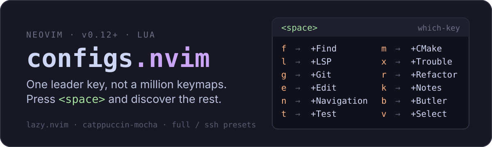
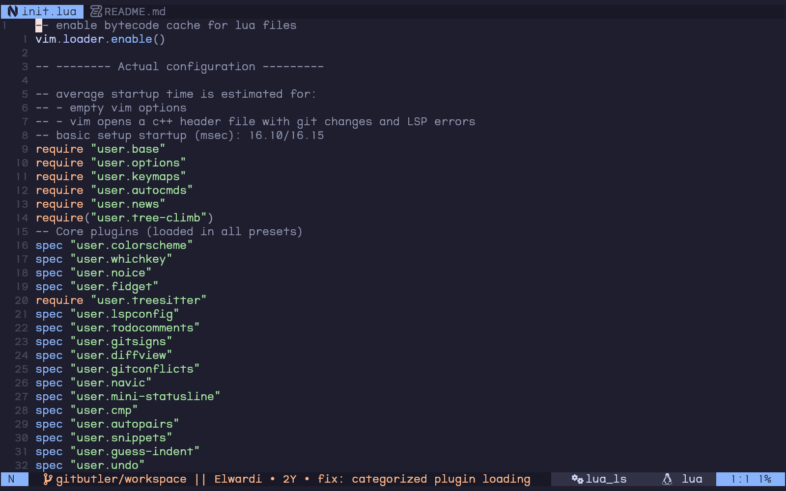

<p align="center">
  
</p>

My minimal(?), clutter-free Neovim configuration for day-to-day programming. Everything is reachable from
`<space>`, so there is nothing to memorize before you start.

```sh
mv ~/.config/nvim ~/.config/nvim.bak    # back up whatever is there
git clone https://github.com/FoamScience/configs.nvim ~/.config/nvim
nvim +ConfigHealth                      # see what is still missing
```

Then press `<space>` and read the menu.

## What it looks like



The [screenshots gallery](/screenshots/README.md) walks through which-key, file exploring, the statusline and
winbar, Noice, todo comments, flash hopping, the symbol outline, LSP features and Git operations.

## What it is

A working config for the languages I write every day:

- C++/C (and OpenFOAM code)
- Python and Lua as scripting languages
- HTML, CSS, JavaScript/TypeScript for web development
- Markdown for documentation, LaTeX for academic writing
- GDScript and GLSL for game development
- Bash for shell scripting

And what it deliberately leaves out:

- Format-on-save is on through conform, but opt-out: `:FormatDisable!` for the buffer, `:FormatDisable` globally
- AI assistants (Copilot, CodeCompanion, Avante) — removed for simplicity
- DAP debugging plugins — removed in favour of simpler debugging workflows

## Getting started

> [!TIP]
> Best used with **Kitty** (or Alacritty if you prefer that), running a PowerLine font, or at least a font
> with some ligature support.


Run `:checkhealth config` (or `:ConfigHealth`) to verify your setup, see what is missing and how to install it.
[This docker file](/dockerImages/config.dockerfile) shows how to install most of it on the latest Ubuntu LTS.

**Required:**

- [Neovim][] **v0.12.x or newer**, [NodeJS][] **v22** (or newer), preferably installed with [NVM][]
- Python 3 and (optionally) [Rust][]
- The tree-sitter CLI: `npm install -g tree-sitter-cli`, or through `cargo`
- `unzip`, for installing some LSP servers
- [RIPGrep][], for todo-comments and various other searching tasks
- A terminal with ligature support ([Kitty][], Warp, Alacritty, etc.)

**Optional:**

- [ImageMagick][] for in-terminal image display, if your terminal supports it
- `latex2text` to render TeX equations in Markdown
- [mermaid-cli][] for mermaid charts in Markdown
  - On Ubuntu 23+ this needs apparmor policy changes around user namespaces; if you do not write mermaid charts
    often, do not bother

<details>
<summary>Kitty font setup I use</summary>

After installing Comic Code Ligatures, Font Awesome and Symbols Nerd Font Mono:

```
font_family      ComicCodeLigatures
symbol_map U+f000-U+f0e2 fontawesome
symbol_map U+23FB-U+23FE,U+2665,U+26A1,U+2B58,U+E000-U+E00A,U+E0A0-U+E0A3,U+E0B0-U+E0D4,U+E200-U+E2A9,U+E300-U+E3E3,U+E5FA-U+E6AA,U+E700-U+E7C5,U+EA60-U+EBEB,U+F000-U+F2E0,U+F300-U+F32F,U+F400-U+F4A9,U+F500-U+F8FF,U+F0001-U+F1AF0 Symbols Nerd Font Mono
```

</details>

<details>
<summary>Try it in Docker instead</summary>

```sh
cd dockerImages
docker build -t nvim-config:latest -f config.dockerfile .
docker run -it --rm nvim-config:latest bash
(container)> USER=me nvim
```

</details>

Once installed, `:ConfigNews` keeps you up-to-date with this repo by checking for new commits and showing a
changelog.

## How you drive it

`<space>` is the leader key; it opens the which-key menu. Beyond that, a handful of conventions carry most of
the day:

| Keys | What it does |
| --- | --- |
| `<tab>` / `<S-tab>` | move between open buffers |
| `s` / `S` | hop anywhere on the visible screen |
| `<C-w><C-w>` | move between windows and splits — too fundamental to change |
| `,` | bookmark files per project; preferred over session management |
| `` ` `` / `"` | see marks positions / registers content |
| `<leader>fk` / `<leader>fC` | list every key binding / every command |
| `<leader>fP` | jump to an individual plugin's configuration |
| `<leader>kk` | project-specific sticky-notes sidebar, in Markdown, persisted |

Typically you will also want Tmux to move between panes with `<C-s><arrows>`.

## Plugins

<details>
<summary><b>General</b> — which-key, pickers, projects, colorscheme, undo</summary>

- [whichkey.lua:](lua/user/whichkey.lua) shows all available keymaps
  - Press `<leader>` to check available keymaps
  - Shows Vim keymaps on `` ` `` (marks), `"` (registers), `z` (folds and spelling), `g` (operators)
    and `<c-w>` (window navigation)
- [snacks.lua:](lua/user/snacks.lua) fuzzy finder via snacks.picker for files, buffers, etc.
  - `<leader>f` to access fuzzy finding features
  - `<leader>fk` shows all configured keymaps
  - `<leader>fg` opens file from its Git history without checking out earlier commits
  - `<leader>fu` browses the Undo tree with diffs
  - `<leader>fP` opens Plugin configuration files
  - Note: Excluded from SSH preset due to performance considerations
- [project.lua:](lua/user/project.lua) a project manager, mostly for detecting root directories
  - `<leader>fp` to open recent projects list
- [dial.lua:](lua/user/optional/dial.lua) a plugin for incrementing and decrementing stuff
  - Overhauled `<c-a>` and `<c-x>` to increment and decrement things (numbers, dates, ..., etc)
- [colorscheme.lua](lua/user/colorscheme.lua) is where the color scheme is set
  - Press `<leader>fc` to see a live demo of all available color schemes
  - By default, we are using [Catppuccin-Mocha](https://catppuccin.com/)
- [undo.lua](lua/user/undo.lua) is an Undo tree visualizer, with diff views. `<leader>eu` to toggle.

</details>

<details>
<summary><b>UI</b> — explorers, statusline, notifications, Markdown and images</summary>

- [snacks.lua](lua/user/snacks.lua) a collection of UI niceties from folke (includes fuzzy finder)
- [nvimtree.lua:](lua/user/nvimtree.lua) a file explorer
  - `<leader>ee` to toggle
- [oil.lua:](lua/user/oil.lua) file explorer as an editable buffer, replaces netrw
  - `-` opens the parent directory
- [mini-statusline.lua](./lua/user/mini-statusline.lua) fast and minimal statusline with enhanced LSP status
- [tpipeline.lua](lua/user/optional/tpipeline.lua) unified statusline for Neovim and Tmux
  - Displays single statusline across both Neovim and Tmux for seamless integration
  - Only loaded in "full" preset
- [incline.lua](lua/user/incline.lua) floating buffer names at top-right corners of windows
- [noice.lua:](lua/user/noice.lua) nicer UI. Not relevant for users
- [fidget.lua:](lua/user/fidget.lua) LSP progress notifications in the corner
- [colorizer.lua:](lua/user/optional/colorizer.lua) colorizes color codes in CSS, HTML, etc.
- [cinnamon.lua:](lua/user/optional/cinnamon.lua) optional scrolling cursor animations.
- [render-markdown.lua:](lua/user/render-markdown.lua) prettifying Markdown document editing.
  - With support for Latex equation rendering
- [guess-indent.lua](lua/user/guess-indent.lua) to guess indentation style (tabs/spaces)
  for current file and setting global options accordingly.
  - Should be automatic, but `:GuessIndent` helps
- [image.lua:](lua/user/image.lua) inline/floating image rendering via image.nvim, replaces `snacks.image`
  - Needs `imagemagick` (`magick`/`convert`) on PATH, and `kitty` or `wezterm` with the kitty graphics protocol enabled
  - `<leader>vi` to render the image under the cursor

</details>

<details>
<summary><b>Productivity</b> — todos, Jira/Confluence, Markdown TOC, images, tests</summary>

- [todo-comments.lua:](lua/user/todocomments.lua) highlights `@todo:`, `@body:`, `@warn:`, etc. in comments
  - `:TodoTelescope` command opens a fuzzy finder for all such comments in the current buffer
  - Use [todo-issue Github action](https://github.com/DerJuulsn/todo-issue) to convert your committed
    Todos to Github issues.
- [atlassian.lua:](lua/user/atlassian.lua) conflira.nvim, a thin Jira and Confluence client (merges the former separate jira/confluence plugins)
  - Loaded only if `JIRA_API_TOKEN` or `CONFLUENCE_API_TOKEN` is set
  - Have to set `JIRA_API_TOKEN`/`CONFLUENCE_API_TOKEN`, `JIRA_URL`/`CONFLUENCE_URL` and `JIRA_EMAIL`/`CONFLUENCE_EMAIL`
  - `<leader>j` for Jira, `<leader>c` for Confluence
- [markdown-toc.lua:](lua/user/markdown-toc.lua) auto-generates and updates a Markdown table of contents
  - Updates on save for Markdown files
- [img-clip.lua:](lua/user/img-clip.lua) pastes clipboard images into the buffer (e.g. Markdown image links)
  - Excluded over SSH
- [neotest.lua:](lua/user/neotest.lua) test runner UI, with neotest-python (pytest) as the Python adapter
  - `<leader>t` for test commands (run nearest/file/directory/last, summary, output, watch)

</details>

<details>
<summary><b>Navigation</b> — flash hopping, outline, trouble, quickfix</summary>

- [flash.lua:](lua/user/flash.lua) fast word hopping
  - `s` (or `gs`) to hop to words in normal mode
  - `S` (or `gS`) to hop using tree-sitter syntax tree in normal mode
  - `r` in operator mode to do operations between flash hops
  - `R` in operator mode to do operations between flash tree-sitter searches
  - `<ctrl-s>` to toggle flash in regular search mode
  - `<leader>v` for incremental treesitter selection (next: `<leader>v`, prev: `<BS>`)
- [outline.lua:](lua/user/outline.lua) fast local code navigation
  - `<leader>nn` to toggle
  - `?` to see keymaps for the outline window
- [trouble.lua:](lua/user/trouble.lua) pretty list for diagnostics, symbols, LSP refs and the quickfix/location list
  - `<leader>x` for Trouble commands
- [qf.lua:](lua/user/qf.lua) nvim-bqf, a better preview and UI for the quickfix window

</details>

<details>
<summary><b>Language support and LSPs</b> — treesitter, mason, completion, formatting, CMake</summary>

- [treesitter/init.lua:](lua/user/treesitter/init.lua) syntax highlighting and code folding, via a thin custom grammar installer (replaces the archived nvim-treesitter plugin)
  - Sets up a few languages by default; such as C++, Python, Lua and OpenFOAM
  - Auto-installs tree-sitter grammars for languages the first time they are encountered
  - with `xonsh` support through the [xonsh-lsp](https://github.com/FoamScience/xonsh-language-server)
- [mason.lua:](lua/user/mason.lua) sets up a few language servers to support common languages
  - C++/C: with `clangd`, OpenFOAM with `foam_ls`, Lua with `lua_ls` and a few more
    - `clangd` is not managed through Mason on ARM machines, run `apt install clangd` instead
  - Python: `pyright` or `pylsp`, with support for ParaView Python (pvpython) environments
  - Type `:Mason` in normal mode for more.
- [lspconfig.lua:](lua/user/lspconfig.lua) configures the LSP servers and sets up keymaps for some features
  - `gd` and `gD` for go to definition and declaration
  - `K` for hover info
  - Enhanced keybindings for type hierarchy, call graphs, and symbol navigation
  - You can also get to similar functionality through `<leader>l` which uses which-key
  - Also pulls in clangd_extensions.nvim (AST view, memory usage) for C++ and lazydev.nvim for Lua/`vim.*` completion
- [cmp.lua:](lua/user/cmp.lua) autocompletion engine using blink.cmp (faster than nvim-cmp)
  - `<tab>` to cycle through suggestions, `<cr>` to confirm
  - Autocompletes file paths, snippets, and LSP-related things
  - Includes Unicode character completion provider for special characters
  - Buffer completion is left to vim's native: `<c-x>-n` menu
  - Also provides command line completion on `:`
- [conform.lua:](lua/user/conform.lua) formatter orchestration (stylua, ruff_format, clang-format, latexindent, typstyle, shfmt, ...)
  - `<leader>lf` to format, falling back to the LSP formatter if none matches
  - Format-on-save; `:FormatDisable[!]` / `:FormatEnable` to toggle
- [cmake-tools.lua:](lua/user/cmake-tools.lua) CMake configure/build/run from inside Neovim
  - `<leader>m` for CMake commands (generate, build, run, select target/type, clean)
  - Soft-links `compile_commands.json` to the project root, which `clangd` picks up
- [refactoring.lua:](lua/user/refactoring.lua) language-aware extract/inline refactors (C++, Python, Lua, ...)
  - `<leader>r` for refactor commands (extract function/variable/block, inline variable)
- [lean.lua:](user-config.elwardi/plugins/lean.lua) Lean 4 theorem prover support via lean.nvim
  - Loads for `*.lean` files
- [typst.lua:](lua/user/optional/typst.lua) live-preview for Typst documents via typst-preview.nvim
  - Opens the preview in the browser for `typst` files
- [navic.lua:](lua/user/navic.lua) shows code structure at the cursor in the winbar
- [remote-nvim.lua:](lua/user/remote-nvim.lua) connect to remote Neovim instances over SSH
  - Commands: `:RemoteStart`, `:RemoteStop`, `:RemoteInfo`
  - Uses telescope for UI (only plugin requiring telescope in this config)

</details>

<details>
<summary><b>Git integration</b> — signs, diffview, conflicts, GitButler</summary>

- [gitsigns.lua:](lua/user/gitsigns.lua) shows git diff in the sign column
- [diffview.lua:](lua/user/diffview.lua) a diff viewer for Git diffs
  - `<leader>gd` to open, or `:DiffviewOpen` in normal mode
- [gitconflicts.lua:](lua/user/gitconflicts.lua) git conflict resolution UI via diffconflicts.nvim
  - `<leader>gt` to open, or `:DiffConflicts` in normal mode
- [butlr.lua:](user-config.elwardi/plugins/butlr.lua) GitButler hunk navigation and actions via butlr.nvim
  - Only enabled inside a GitButler-managed repo (needs the `but` CLI)
  - `<leader>b` for Butler commands (navigate hunks, rub/assign, absorb, discard, undo)

</details>

<details>
<summary><b>Miscellaneous</b> — autopairs, CSV, line notes, cloaking, wrapped</summary>

- [autopairs.lua:](lua/user/autopairs.lua) automatically inserts closing brackets, quotes, etc.
- [csv.lua:](lua/user/optional/csv.lua) a CSV viewer/editor using csvview.nvim.
  - `<leader>cv` toggles the aligned CSV display
- [haunt.lua:](lua/user/optional/haunt.lua) Line notes that do not affect the code source.
- [cloak.lua:](lua/user/optional/cloack.lua) Hiding environment variables.
  - `:CloackDisable` to see the variables' values.
- [wrapped.lua:](user-config.elwardi/plugins/wrapped.lua) a GitHub-Wrapped-style yearly recap via wrapped.nvim (UI built on nvzone/volt)
  - `:WrappedNvim` to open

</details>

## Presets

Two presets adapt the config to where you are running it:

- **full** (default): all plugins enabled
- **ssh**: excludes plugins that do not work well over SSH, mostly the ones adding latency overhead

Three ways to select one, in order of priority:

```bash
# 1. Local preset file — recommended for per-machine configuration
cp ~/.config/nvim/preset.lua.example ~/.config/nvim/preset.lua   # then edit the return value

# 2. Environment variable — useful for one-time overrides
NVIM_PRESET=ssh nvim

# 3. Neither of the above: falls back to "full"
```

For remote editing, `echo 'return "ssh"' > ~/.config/nvim/preset.lua` on the remote machine is usually what you
want.

## Tutorials

A few tutorials open with `<leader>tt` when `nvim` is started without files. They are not meant to teach basic
Vim skills, but rather explain my current approach to editing efficiency. They act on Lua files, but hold for
any other filetype.

Occasionally you will need `:TutorialNext` to continue — either because I was too lazy to implement proper step
validation, or because implementing it would not have been a good experience.

## Extending it with your own config

Keep your customizations in a separate git repository so you can pull updates from here without conflicts:

```
my-nvim-config/
├── init.lua              # Optional: runs before lazy.nvim loads
└── plugins/              # Optional: custom plugin specs
    ├── my-plugin.lua
    └── another.lua
```

Symlink it into place:

```bash
ln -s /path/to/my-nvim-config ~/.config/nvim/user-config
```

Or take mine — mostly niche and experimental:

```bash
ln -s user-config.elwardi user-config
```

`init.lua` is executed before lazy.nvim initialization, and everything in `plugins/` is loaded as a plugin
spec. A spec is just a lazy.nvim table:

```lua
return {
    "username/my-colorscheme",
    config = function()
        vim.cmd("colorscheme my-colorscheme")
    end
}
```

## Plugin versions

All plugins are pinned through [Lazy.nvim][]'s lockfile, so installations stay consistent and a plugin update
cannot break your editor unannounced. The workflow for staying current:

1. `:ConfigNews` — fetches the remote, shows how many commits you are behind and a changelog
2. `git pull` in `~/.config/nvim`
3. Review `lazy-lock.json` changes, if any
4. Restart nvim

`:Lazy update` also works, but it will diverge from this repo's pinned versions.

[Neovim]: https://github.com/neovim/neovim/releases "Neovim"
[NVM]: https://github.com/nvm-sh/nvm "NVM"
[NodeJS]: https://nodejs.org "NodeJS"
[RIPGrep]: https://github.com/BurntSushi/ripgrep "RIPGrep"
[Kitty]: https://sw.kovidgoyal.net/kitty/binary/ "Kitty"
[Rust]: https://www.rust-lang.org/tools/install "Rust"
[ImageMagick]: https://imagemagick.org/index.php "ImageMagick"
[mermaid-cli]: https://github.com/mermaid-js/mermaid-cli "Mermaid-cli"
[Lazy.nvim]: https://github.com/folke/lazy.nvim "Lazy.nvim"
