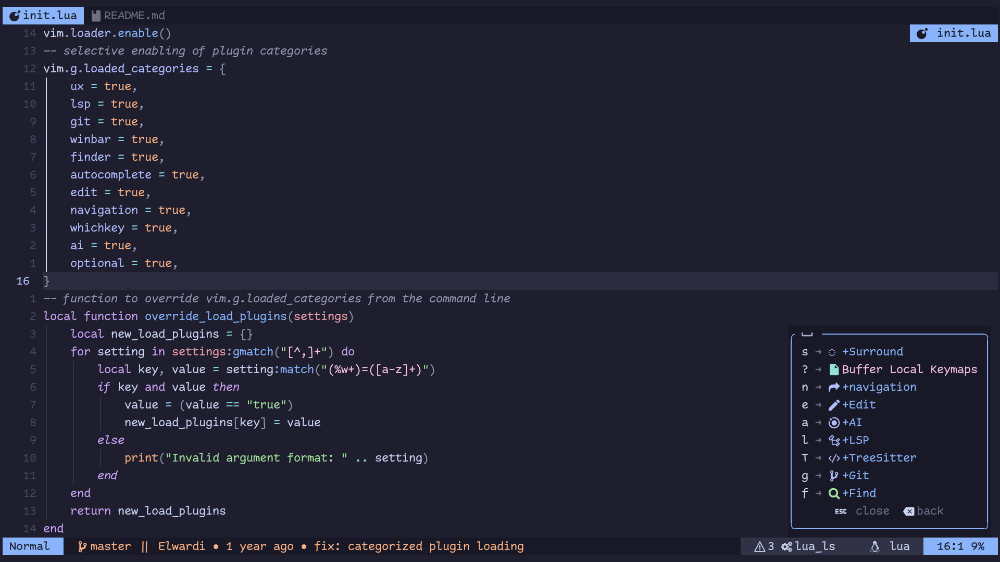
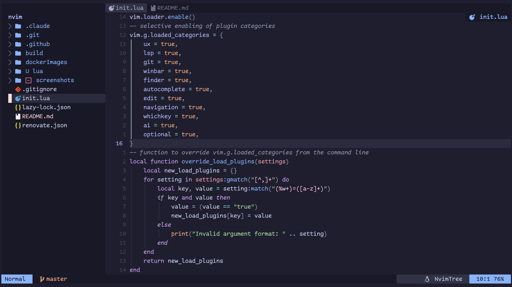
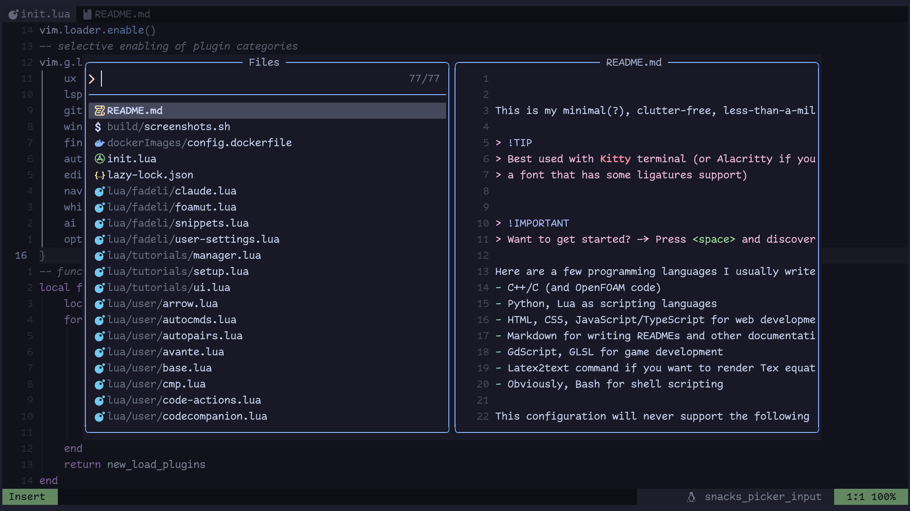
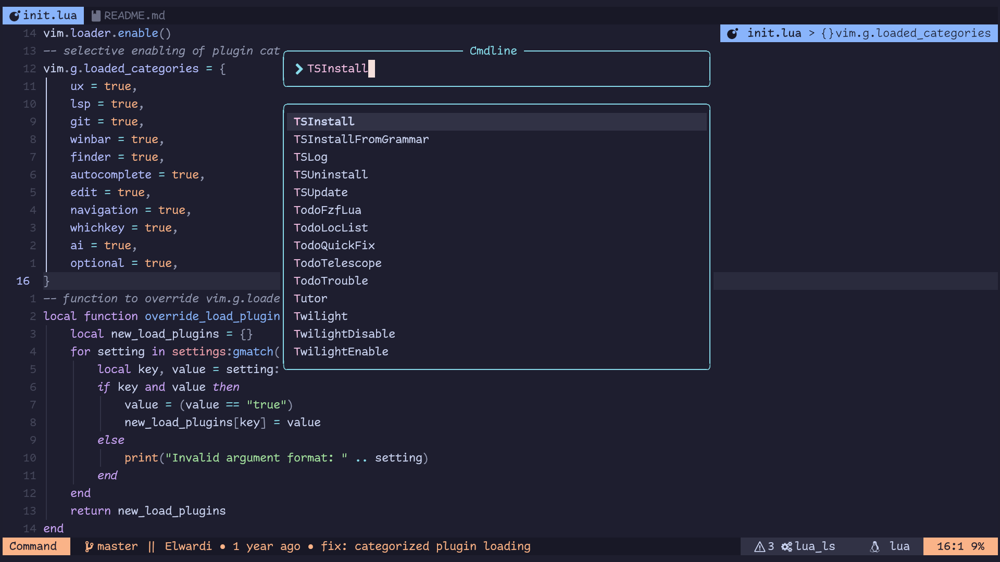
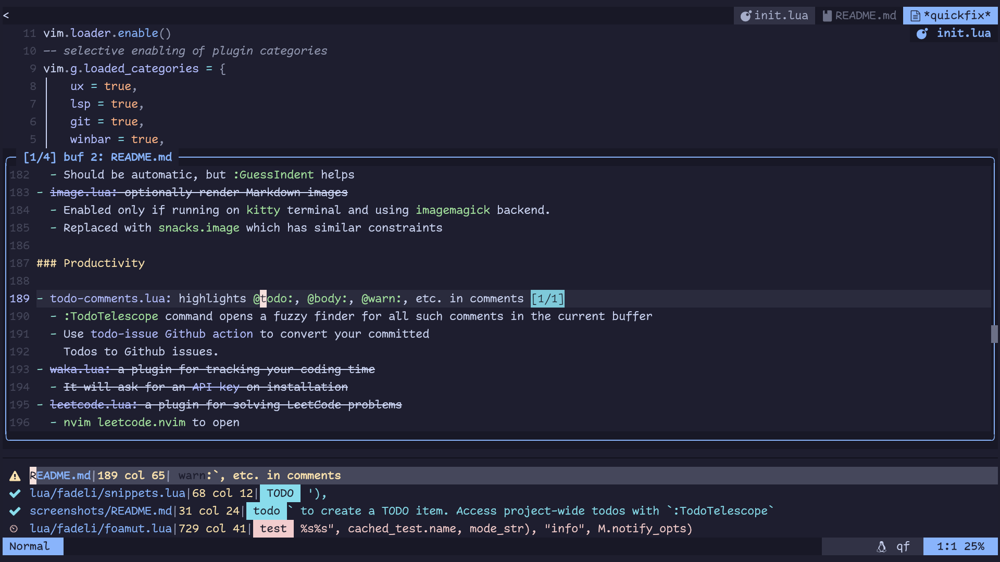
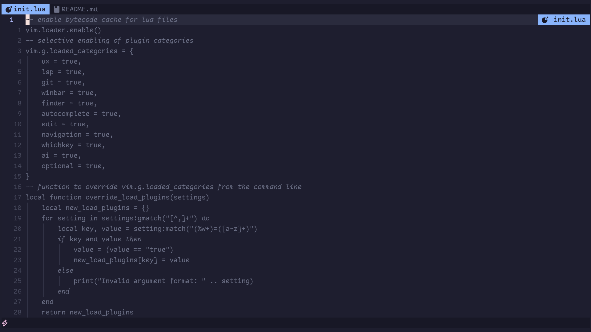
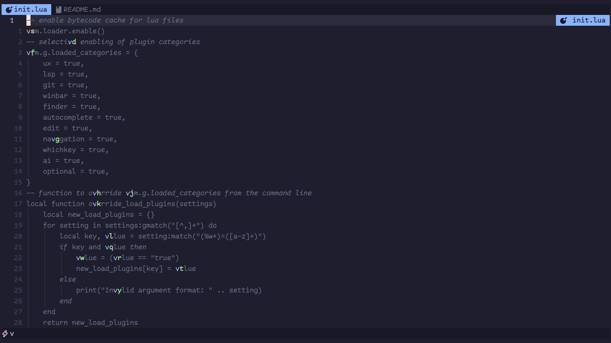
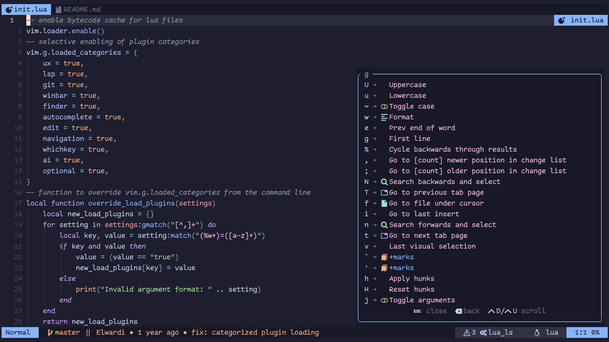

# Screenshots gallery

## Which-key
It's OK to forget all of the key-mappings; press `<leader>` (Space key by default) and see what's available.

## File exploring? If you want it
Rename, delete and create files and directories, all from within Neovim.

## Statusline & winbar
- Minimal statusline with git branch/commit/blame info, and LSP output 
- A floating winbar with current code context

## Nicer UI with Noice
Command-line at the top, auto-completed. Messages at bottom-right corner.

## File bookmarks with arrow
Press `,` to set repo-specific bookmarks for a super-fast workflow:

## TODOs right in the code, convertible to Github issues
In you comments type `@todo:` to create a TODO item. Access project-wide todos with `:TodoTelescope`

## Navigate text words like never before
Press `s` and then type in the highlighted character labels to jump to where you want to go.

- Press `s`, assume you want to get to `value` 20 lines down.
  
- Press `v` and then whatever green label character appears to jump
  

## Code symbols outline and easy navigation
`<leader>nn` to open the outline if an LSP server is attached to the buffer.

## LSP features
The usual hover, go to definition, find references, rename, and more LSP functionality.
Diagnostics and formatting are also available by default for a few languages.

All accessible through `<leader>l` menu, and a few through `g` (for default neovim mappings)

## Git operations
`<leader>g` is your Git hub, you could also use `:Diff*` commands

## AI-assisted programming

CodeCompanion is used to hook AI agents. Get started with `:CodeCompanionChat` or `<leader>a` menu
