# Screenshots gallery

## Which-key
It's OK to forget all of the key-mappings; press `<leader>` (Space key by default) and see what's available.

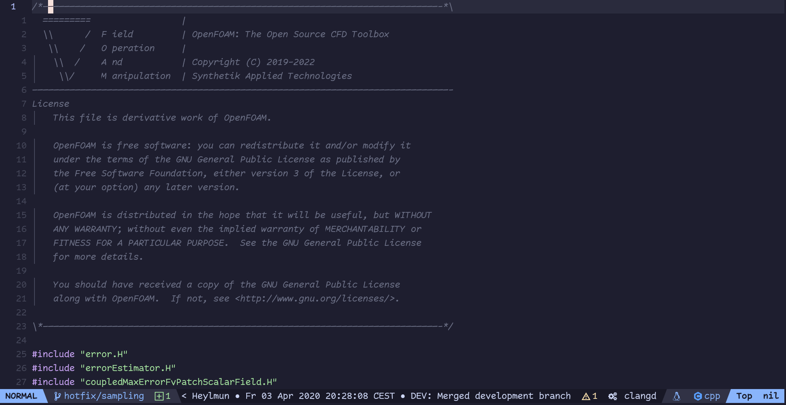

## File exploring? If you want it
Rename, delete and create files and directories, all from within Neovim.

## Statusline & winbar
With code context, git branch/commit info, git blame info, and LSP output 

## Nicer UI with Noice
Command-line at the top, auto-completed. Messages at bottom-right corner.

## File bookmarks with arrow
Press `,` to set repo-specific bookmarks for a super-fast workflow:

## Dim inactive code while presenting
Does what is says!

## Split/join code blocks
Press `<leader>m` to split the function arguments (not just arguments, but any code block) into multiple lines:

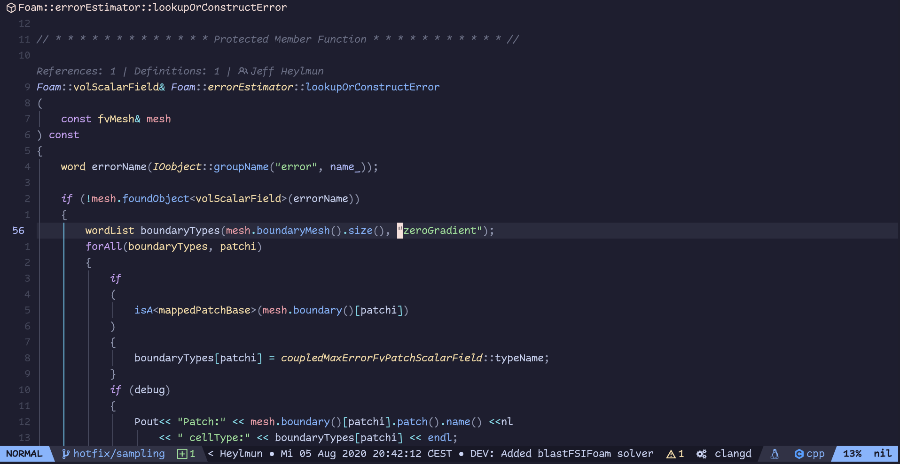

## TODOs right in the code, convertible to Github issues
In you comments type `@todo:` to create a TODO item.

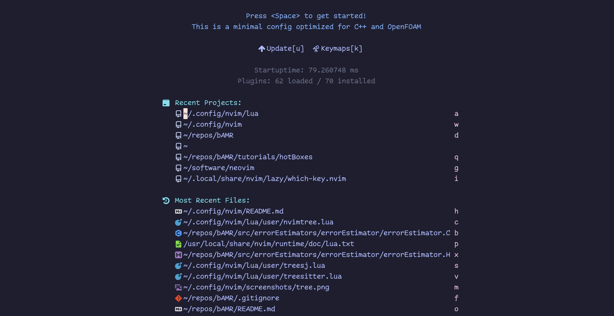

## Navigate text words like never before
Press `s` and then type in the highlighted character to jump to where you want to go.
Go anywhere on screen with at most 3 keystrokes.

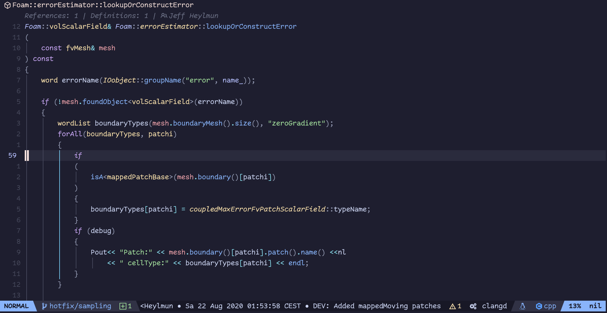

## Code symbols outline and easy navigation
`<c-o>` to open the outline if an LSP server is attached to the buffer.

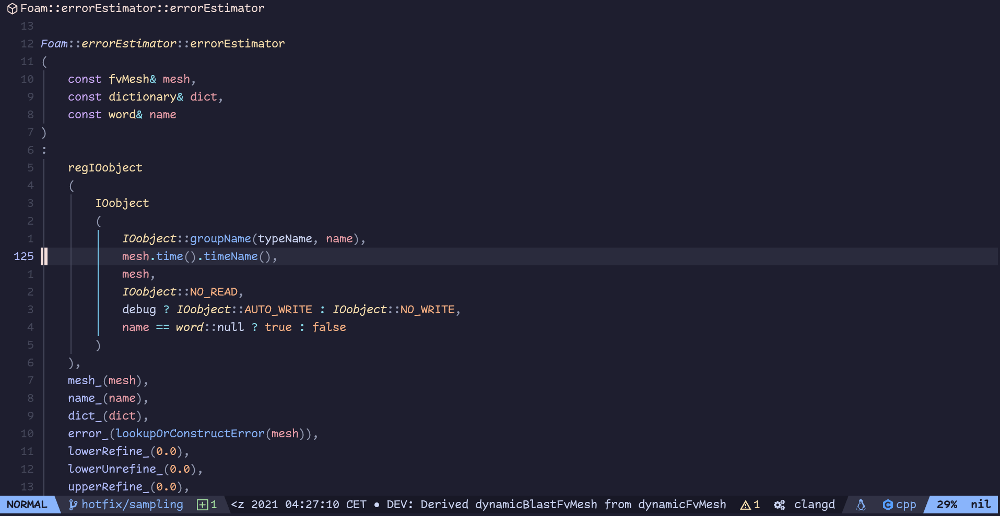

## LSP features
The usual hover, go to definition, find references, rename, and more LSP functionality.
Diagnostics and formatting are also available by default for a few languages.
Adding support for more languages is hustle-free.

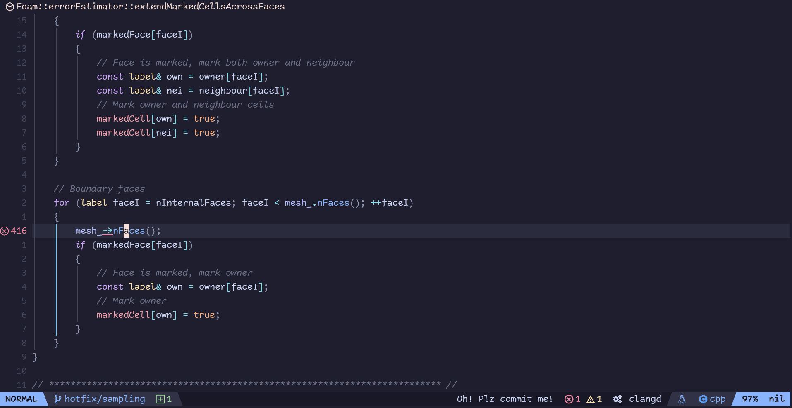

## Auto-completes everything
Type `/@` in normal mode to search through **code symbols** only (Functions, classes, etc) .
This works for any language. OpenFOAM dictionaries are also supported. Compare regular search
with symbols-only search for `dynamicFvMesh` keyword in the following OpenFOAM dictionary:

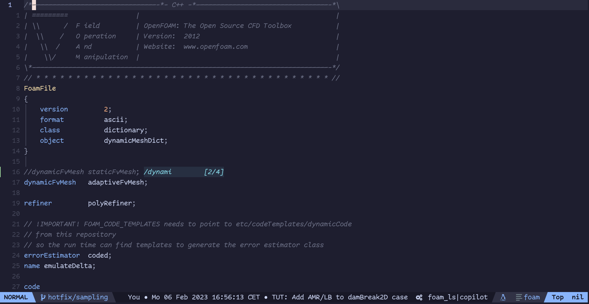

Autocompletion is almost always ongoing; the editor takes no break; even when calling internal Lua functions

## Search public code with Sourcegraph
Go `:SourceGraphSearch` and type `Foam::UList`, a list of all public implementations of that class will appear.
By selecting an implementation, you get its header file in a new buffer, no need to clone whole repos!

This comes in handy for AI-assisted programming

## Git diff view for conflicts history
Just got a conflicting merge? Start with `<leader>dd`, a Three-way diff to figure out the history from both branches.

## Git diff for conflict resolution
To actually resolve the conflict, `<leader>gt` shows nicer diffs.

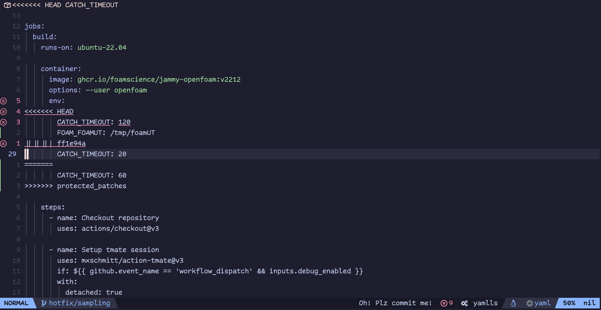

## AI-assisted programming
The AI facility is experimental at best and uses only free chat backends. Here I showcase the most important
and stable-sh features, `:Chat` will autocomplete to all available commands.

## AI fixes LSP diagnostics for you
LSP is complaining about something? 

Visual-select context lines around the LSP error or warning, and run `ChatCodeFix` command to fix it!
Always double-check the AI's suggestions as the text edits might not be accurate.

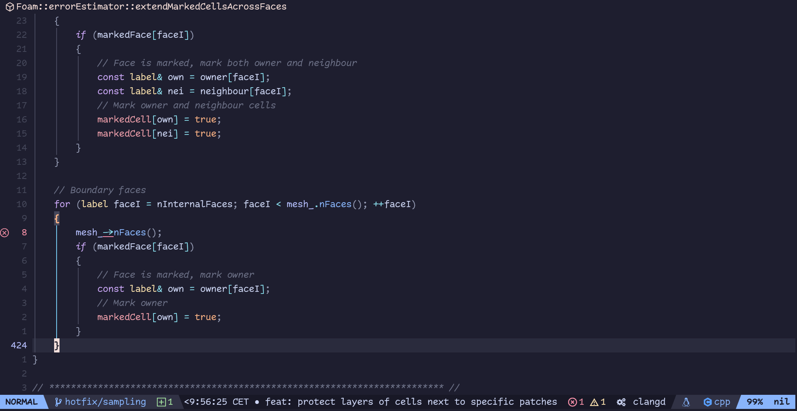

## AI answers to your questions using public Git diffs
Want to know when (in the Git commit history) did OpenFOAM move from `MPI_WORLD_COMM` to its own communicator?

Pop an AI window with `:ChatGitDiffs`; type your question and the framework in question. Neovim will run
a public diffs search in the background and present you with the commits that might have what you are looking for.

You also get a link to the commit you select in your clipboard ('+' registry).

## AI reviews your code
Just finished writing a small function? Have the AI review your code:

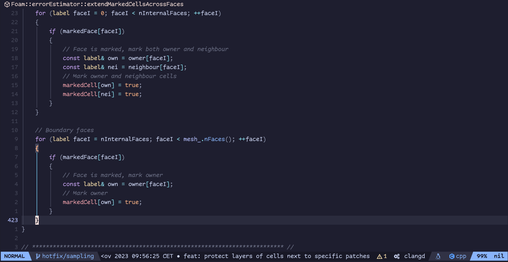

You can also set the reviewing focus (Maintability, performance, ... etc) with `:ChatCodeReviewSetFocus` command.

## AI documents your code
Visual-select a portion of the code and send it the AI agent to add docs comments before it:

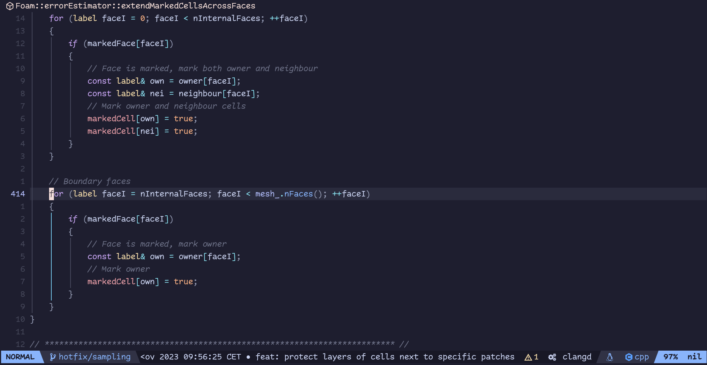

## AI helps you discover how to do a programming task
Fire a `:ChatCodeDiscover`, put your question and the framework in question. The AI engine will try
to guess a function call and will search for it structurally in public repositories related to your framework.

In the following example, notice how there is no mention of `reduce` in the question. The AI guesses that to
sum up a variable from all MPI processes, you will have to call `reduce` with two parameters.
We are greedy with parameters and we look for `reduce(..., ...)` in public code repos using Cody (through sg.nvim).

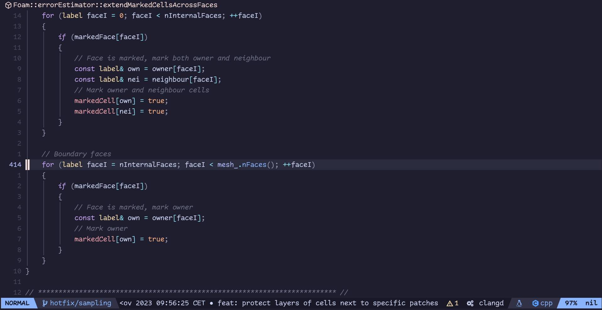

Notice that it is more accurate to look for `reduce(..., sumOp<...>())` instead, but the free AI backends are
not there yet. This might be possible in the future with Cody contexts.

