# Screenshots gallery

## Which-key
It's OK to forget all of the key-mappings; press `<leader>` (Space key by default) and see what's available.

## File exploring? If you want it
Rename, delete and create files and directories, all from within Neovim.
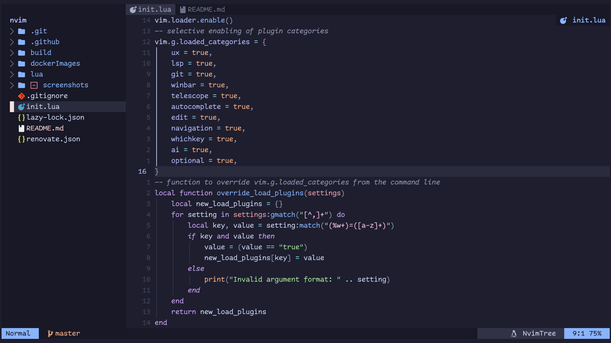

## Statusline & winbar
With code context, git branch/commit info, git blame info, and LSP output 
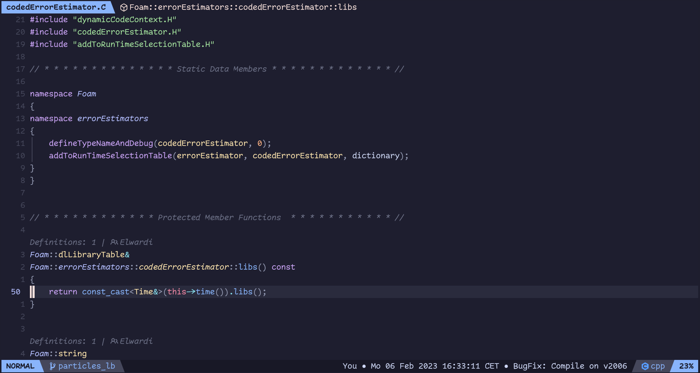

## Nicer UI with Noice
Command-line at the top, auto-completed. Messages at bottom-right corner.
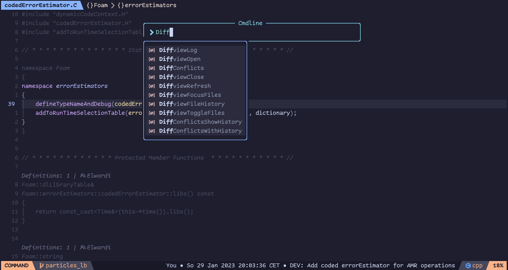

## Dim inactive code while presenting
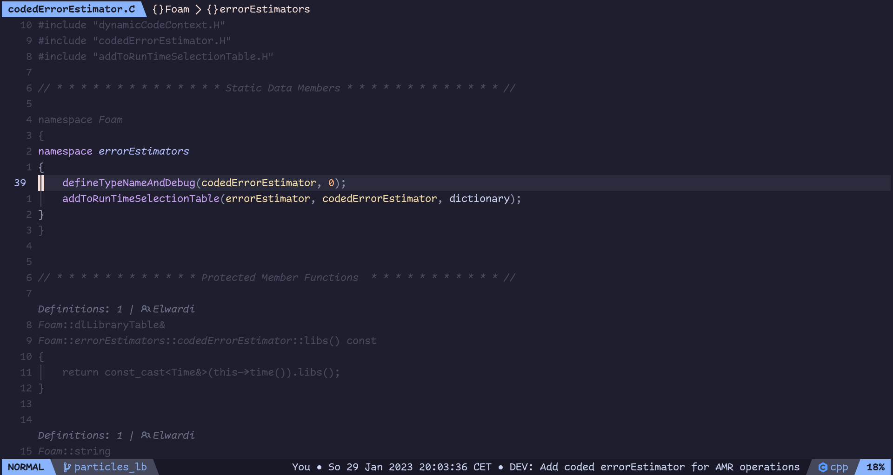

## Split/join code blocks
Start with this:
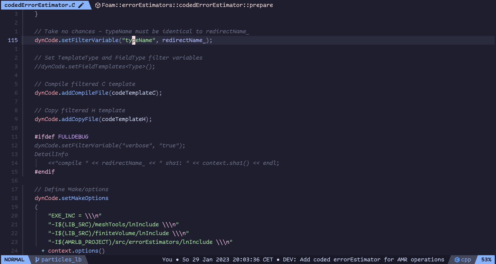
Press `<leader>m` to split the function arguments (not just arguments, but any code block) into multiple lines:
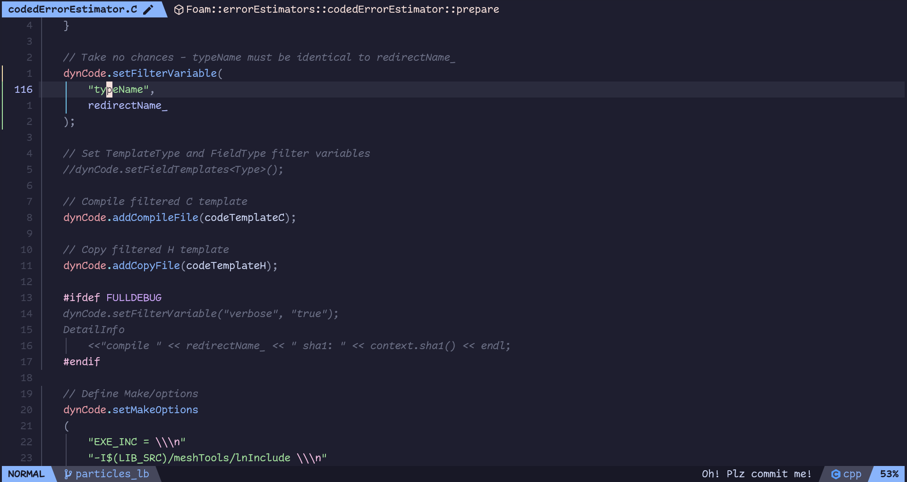

## TODOs right in the code, convertible to Github issues
If you comments type `@todo:` to create a TODO item.
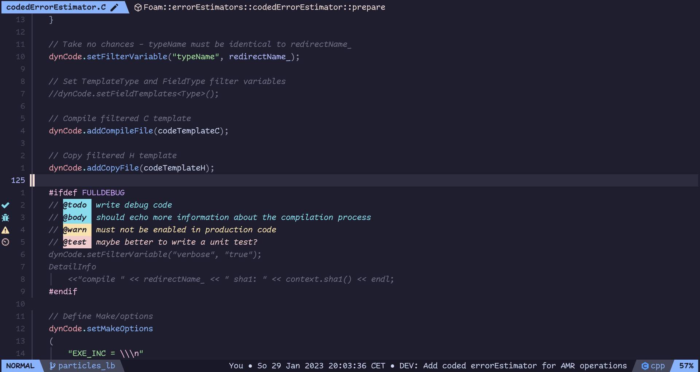

## Browse docs
For any language you want, as long as it's on [devdocs.io](https://devdocs.io/)
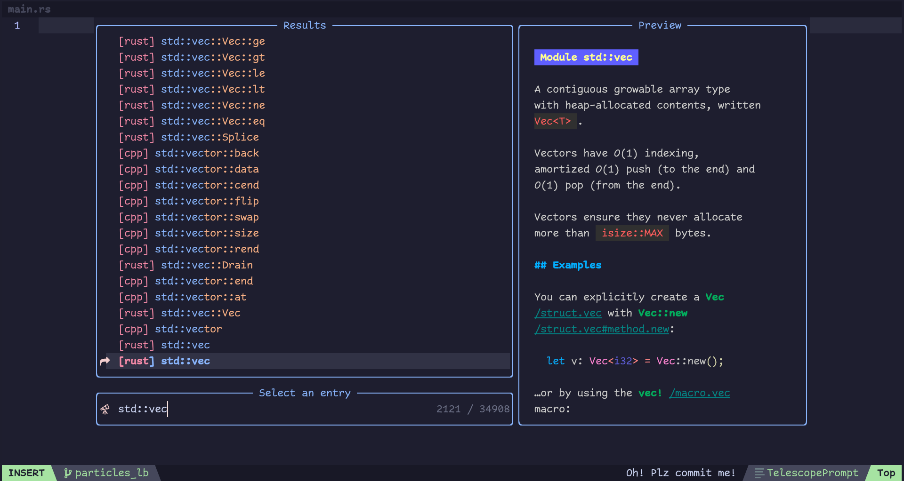

## Navigate text words like never before
Press `s` and then type in the highlighted character to jump to where you want to go.
Go anywhere on screen with at most 3 keystrokes.
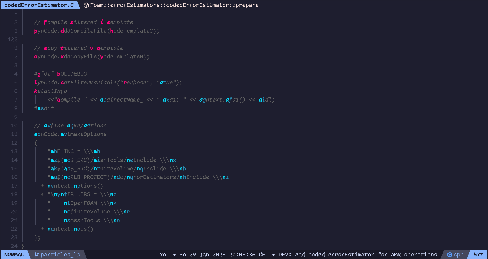

## Code symbols outline and easy navigation
`<c-o>` to open the outline if an LSP server is attached to the buffer.
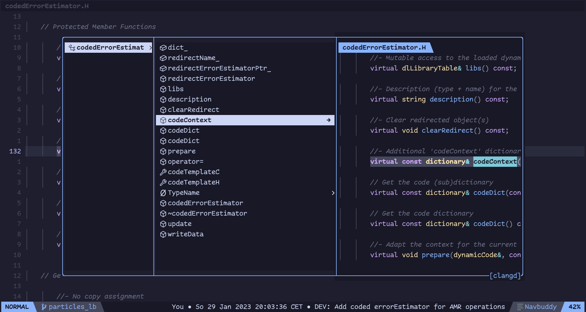

## LSP features
The usual hover, go to definition, find references, rename, and more LSP functionality.
Diagnostics and formatting are also available by default for a few languages.
Adding support for more languages is hustle-free.
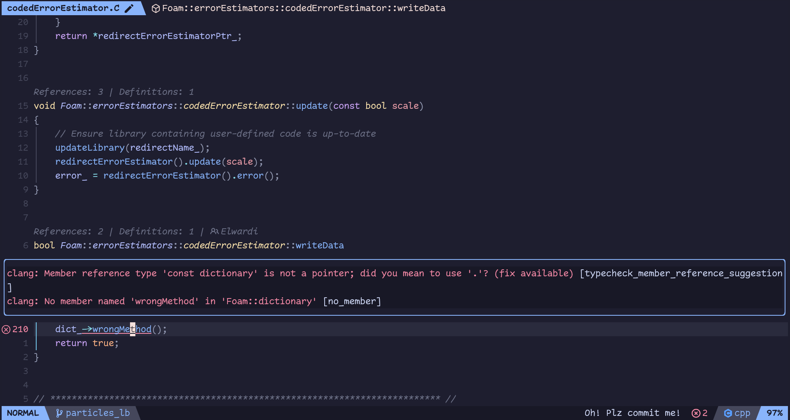

## Auto-completes everything
Type `/@` in normal mode to search through **code symbols** only (Functions, classes, etc) .
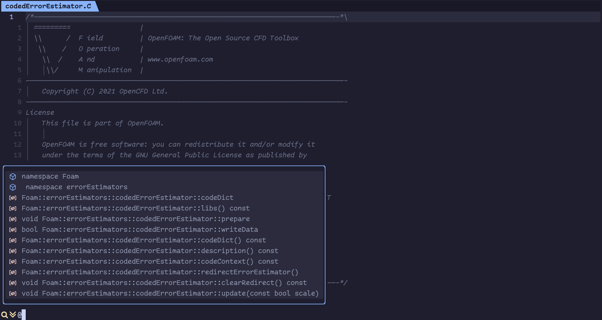
This works for any language. OpenFOAM dictionaries are also supported.

Autocompletion is almost always ongoing; the editor takes no break; even when calling internal Lua functions

## Search public code with Sourcegraph
Go `<leader>ss` and type `Foam::UList`, a list of all public implementations of that class will appear.
By selecting an implementation, you get its header file in a new buffer, no need to clone whole repos!
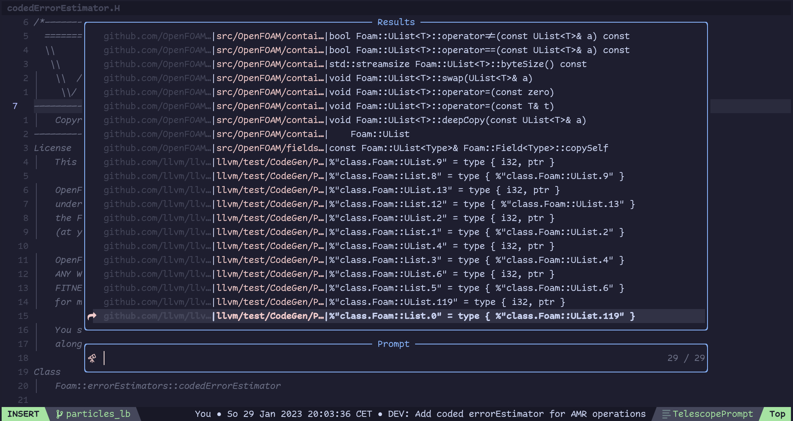

## Pipe LSP diagnostics to AI
LSP is complaining about something? Pipe the diagnostics to AI and get a suggestion on how to fix it!
Visual-select the implementation of `writeData` method to provide as context, and press `<leader>ad`.
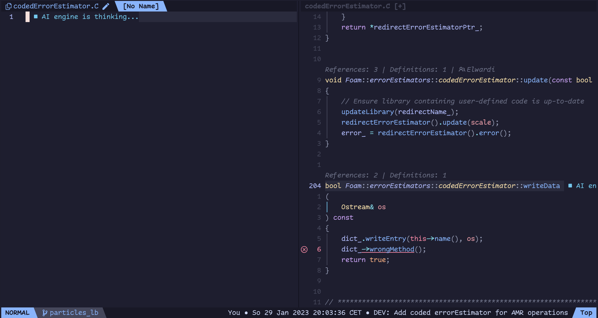
After some thinking, the AI will drop its response in a new Markdown buffer, with syntax highlighting and everything.
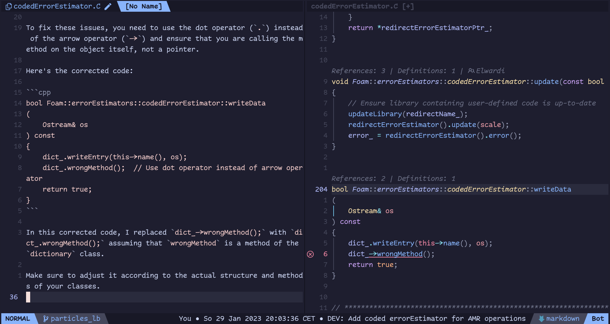

## Git diff view for conflicts history
Just got a conflicting merge? Start with `<leader>dd`, a Three-way diff to figure out the history from both branches.
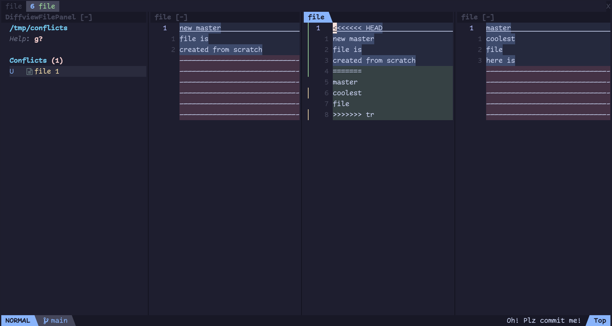

## Git diff for conflict resolution
To actually resolve the conflict, `<leader>gt` shows nicer diffs.
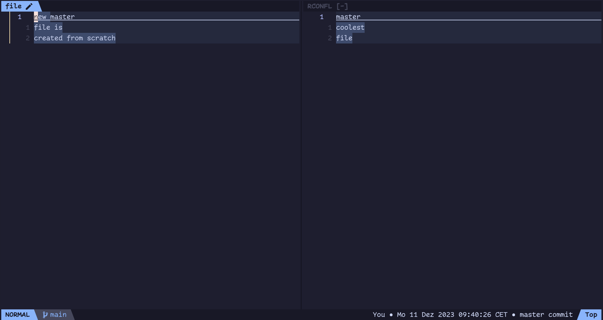
